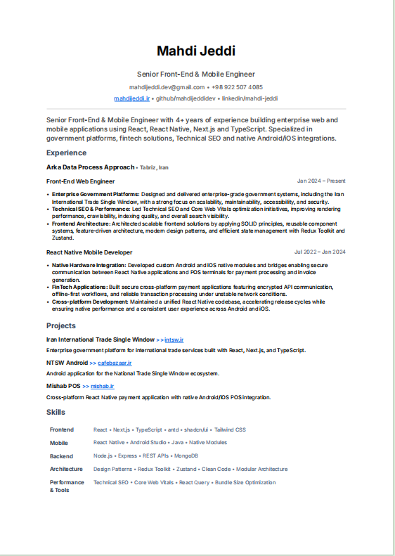
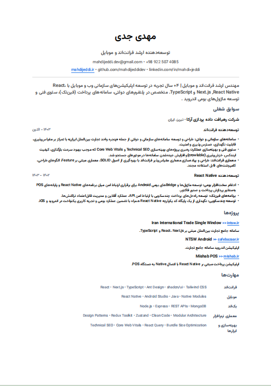

# 📄 Typst Bilingual Resume

A clean, ATS-friendly bilingual resume template built with **Typst**.

Generate professional English and Persian resumes from the same project structure while keeping the layout consistent and easy to maintain.

---

## Features

- 🌍 English & Persian resumes
- 📑 ATS-friendly layout
- ⚡ Fast compilation with Typst
- 🎨 Custom fonts (Inter & Vazir)
- 📂 Organized project structure
- 🔗 Clickable links (Website, GitHub, LinkedIn)
- 🛠 Easy customization

---

## Preview

### English Resume



### Persian Resume



---

## Project Structure

```text
.
├── assets/
│   └── fonts/
│       ├── Inter/
│       └── Vazir/
│
├── output/
│   ├── resume-en.pdf
│   └── resume-fa.pdf
│
├── preview/
│   ├── resume-en.png
│   └── resume-fa.png
│
├── scripts/
│   ├── watch-en.bat
│   └── watch-fa.bat
│
├── src/
│   ├── components/
│   ├── data/
│   │   ├── en.typ
│   │   └── fa.typ
│   ├── page.typ
│   └── resume.typ
│
├── main-en.typ
├── main-fa.typ
└── README.md
```

---

## Requirements

Install Typst:

https://typst.app/

or via Cargo:

```bash
cargo install typst-cli
```

---

## Development

### Watch English Resume

```bash
scripts\watch-en.bat
```

This watches `main-en.typ` and automatically writes:

```text
output/resume-en.pdf
```

---

### Watch Persian Resume

```bash
scripts\watch-fa.bat
```

This watches `main-fa.typ` and automatically writes:

```text
output/resume-fa.pdf
```

---

## Fonts

This project uses custom fonts located in:

```text
assets/fonts/
```

- Inter
- Vazir

The watch scripts automatically provide the font path to Typst.

---

## Customization

Resume content lives inside:

```text
src/data/en.typ
src/data/fa.typ
```

You can edit:

- Profile
- Summary
- Experience
- Projects
- Skills
- Section titles

without touching the layout.

---

## Built With

- Typst
- Inter Font
- Vazir Font

---

## License

MIT